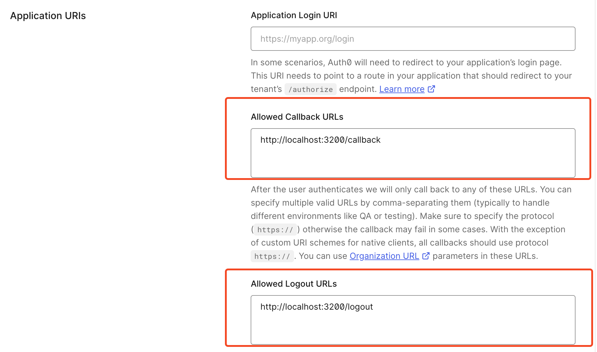

This repo demonstrates how to use auth0 to auth.

Reference to https://auth0.com/docs/quickstart/webapp/golang/01-login#configure-auth0

### Step 1: Create Application in Auth0

### Step 2: Configure the callback / logout URL



### Step 3: put credentials in .env

```sh
AUTH0_DOMAIN=xxx
AUTH0_CLIENT_ID=xxx
AUTH0_CLIENT_SECRET=xxx
```

### Step4: Run the code

